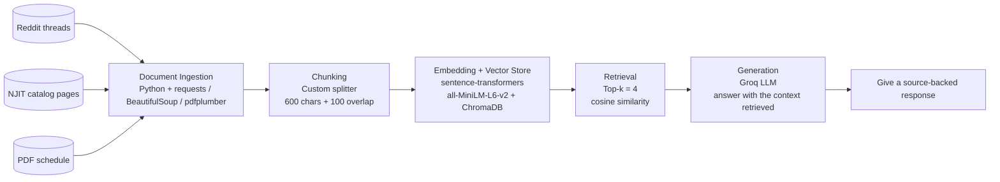

# Project 1 Planning: The Unofficial Guide

> Write this document before you write any pipeline code.
> Your spec and architecture diagram are what you'll use to direct AI tools (Claude, Copilot, etc.) to generate your implementation — the more specific they are, the more useful the generated code will be.
> Update the Retrieval Approach and Chunking Strategy sections if you change your approach during implementation.
> Update this file before starting any stretch features.

---

## Domain

The domain I chose was Computer Science course recommendations at the New Jersey Institute of Technology. This information may be hard to find on official channels because students are not given the opportunity to honestly review the classes they take on an official platform. It may also be hard to keep track of prerequisites and corequisites for certain classes because there is no official platform that does so for students. 

---

## Documents

<!-- List your specific sources: URLs, subreddit names, forum threads, or file descriptions.
     Aim for at least 10 sources that together cover different subtopics or perspectives within your domain. -->

| # | Source | Description | URL or location |
|---|--------|-------------|-----------------|
| 1 | Reddit | A thread in which the poster asks for 300-level electives. | https://www.reddit.com/r/NJTech/comments/1hjjoy9/cs_electives/ |
| 2 | Reddit | A thread in which the user asks for 300-level electives with the least workload. | https://www.reddit.com/r/NJTech/comments/tpyvgc/easiest_300_level_cs_electives/ |
| 3 | NJIT | A page that lists all of the Computer Science courses that can be taken at NJIT, including prerequisites for each course. | https://catalog.njit.edu/undergraduate/computing-sciences/computer-science/#coursestext |
| 4 | NJIT | A page that lists Informatics courses, many of which can be taken in conjunction with Computer Science. | https://catalog.njit.edu/undergraduate/computing-sciences/informatics/#coursestext | 
| 5 | NJIT | A page that shows an example schedule for a B.S. student in Computer Science. | https://catalog.njit.edu/undergraduate/computing-sciences/computer-science/bs/bs.pdf |
| 6 | Reddit | Poster requests advice on NJIT's CS graduate program and specific courses. | https://www.reddit.com/r/NJTech/comments/16jjtb3/advice_needed_regarding_njits_computer_science/ |
| 7 | College Class Reviews | The best and worst rated classes at NJIT. | https://collegeclassreviews.com/universities/new-jersey-institute-of-technology/top-courses |
| 8 | College Class Reviews | The hardest courses at NJIT, according to students. | https://collegeclassreviews.com/universities/new-jersey-institute-of-technology/rankings/hardest-courses |
| 9 | Reddit | Posters asks about the difficulty of CS courses at NJIT. | https://www.reddit.com/r/NJTech/comments/5hrikz/how_is_the_difficulty_of_some_of_the_cs_courses/ |
| 10 | NJIT | Latest news from the CS department at NJIT. | https://news.njit.edu/ |

---

## Chunking Strategy

<!-- How will you split documents into chunks?
     State your chunk size (in tokens or characters), overlap size, and explain why those
     numbers fit the structure of your documents.
     A review-heavy corpus warrants different chunking than a long FAQ. -->

**Chunk size:**
My chunk size will be 600 characters. 

**Overlap:**
My overlap size will be 100 characters. 

**Reasoning:**
After browsing through my documents, it seems like most of the NJIT pages contain information in chunks of 500-600 characters. The reviews are definitely shorter, but can be grouped with their replies in about 400-500 characters. I gave them a leeway of 100 characters because the reviews and course descriptions often vary up to 100 characters. 
---

## Retrieval Approach

<!-- Which embedding model are you using (e.g., all-MiniLM-L6-v2 via sentence-transformers)?
     How many chunks will you retrieve per query (top-k)?
     If you were deploying this for real users and cost wasn't a constraint, what tradeoffs
     would you weigh in choosing a different embedding model — context length, multilingual
     support, accuracy on domain-specific text, latency? -->

**Embedding model:**
I am going to use all-MiniLM-L6-v2 via sentence-transformers.

**Top-k:**
I will retrieve four chunks per query. 

**Production tradeoff reflection:**
If there were no constraints in this project, I would choose an embedding model that offers multilingual support due to NJIT's large international student population. 

---

## Evaluation Plan

<!-- List your 5 test questions with their expected correct answers.
     Questions should be specific enough that you can judge whether the system's response
     is right or wrong. "What are good dining halls?" is too vague.
     "What do students say about wait times at [dining hall name] during lunch?" is testable. -->

| # | Question | Expected answer |
|---|----------|-----------------|
| 1 | Which CS class at NJIT is most commonly rated among one of the hardest? | CS 350 |
| 2 | Which CS professor at NJIT is most commonly rated among the worst? | Professor Bassel |
| 3 | Which CS professor at NJIT do students enjoy taking? | Professor Dale |
| 4 | What are the prerequisites of CS 288? | CS 280 and CS 100 |
| 5 | What is an easy CS elective to take at NJIT? | CS 485 |

---

## Anticipated Challenges

<!-- What could go wrong? Name at least two specific risks with reasoning.
     Consider: noisy or inconsistent documents, missing source attribution, off-topic
     retrieval, chunks that split key information across boundaries. -->

1. Chunks might split key information. I expect this to happen with the Reddit threads in particular, because people answer in highly different amounts. 

2. Some documents might be hard to break down or contain too much irrelevant information. Not all of the Reddit threads contain information that cover all courses, and only the most popular ones get brought up. The College Class Reviews pages also cover courses from majors outside of CS. 

---

## Architecture

<!-- Draw a diagram of your pipeline showing the five stages:
     Document Ingestion → Chunking → Embedding + Vector Store → Retrieval → Generation
     Label each stage with the tool or library you're using.
     You can use ASCII art, a Mermaid diagram, or embed a sketch as an image.
     You'll use this diagram as context when prompting AI tools to implement each stage. -->

---

## AI Tool Plan

<!-- For each part of the pipeline below, describe:
     - Which AI tool you plan to use (Claude, Copilot, ChatGPT, etc.)
     - What you'll give it as input (which sections of this planning.md, which requirements)
     - What you expect it to produce
     - How you'll verify the output matches your spec

     "I'll use AI to help me code" is not a plan.
     "I'll give Claude my Chunking Strategy section and ask it to implement chunk_text()
     with my specified chunk size and overlap" is a plan. -->

**Milestone 3 — Ingestion and chunking:**

I will use **Copilot** for the ingestion and chunking code. I will give it the `Documents` section, the `Chunking Strategy` section, and the requirement that the pipeline needs to handle Reddit threads, NJIT catalog pages, and the other websites I have included. I will ask it to generate code that fetches HTML, cleans the documents, and splits them into 600-character chunks with 100 characters of overlap. Then, I will test it on a few sample sources and make sure the chunks keep headings, course numbers, and reply context intact.

**Milestone 4 — Embedding and retrieval:**

I will use **Claude** for the embedding and retrieval pipeline. I will give it the `Retrieval Approach` section, the `Architecture` diagram, and the requirement to use `sentence-transformers`, `all-MiniLM-L6-v2`, and `ChromaDB`. I expect that it will build the embedding step, store vectors in ChromaDB, and retrieve the top 4 matches in terms of cosine similarity. I will check a few questions from my `Evaluation Plan` and confirm that the retrieved chunks come from the right sources and mention the right course or professor.

**Milestone 5 — Generation and interface:**

I will use **Claude** again for the response-generation and interface layer. I will give it the `Architecture` diagram, the `Evaluation Plan`, and the requirement that the final answer should be accurate to the retrieved chunks. I expect it to produce a prompt template for the LLM, a response formatter with source-backed answers, and a simple interface for testing queries. I will verify it by making sure the answers stay within the retrieved context, include sources when possible, and answer the five test questions without adding unsupported details.
